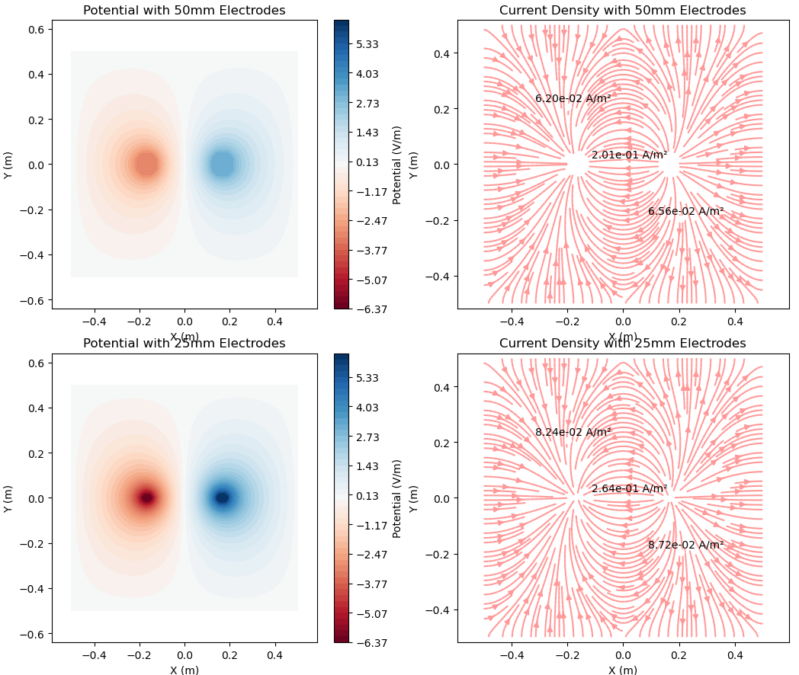

April 11, 2024
Ido Haber

---

This is a quick simplified simulation aim to illustrate the differnces in:

    - Potential (V)
    - Current Density (A/m2)
    - Electric Field (V/m)

given a 2D conductive isotropic medium and two different electrode geometries.

---

---

The goal of this is to simplified the visualization and verification that electrode geometry plays a critical role on the disribution of the field. So researceher working on NIBS should optimize electrode choise.
