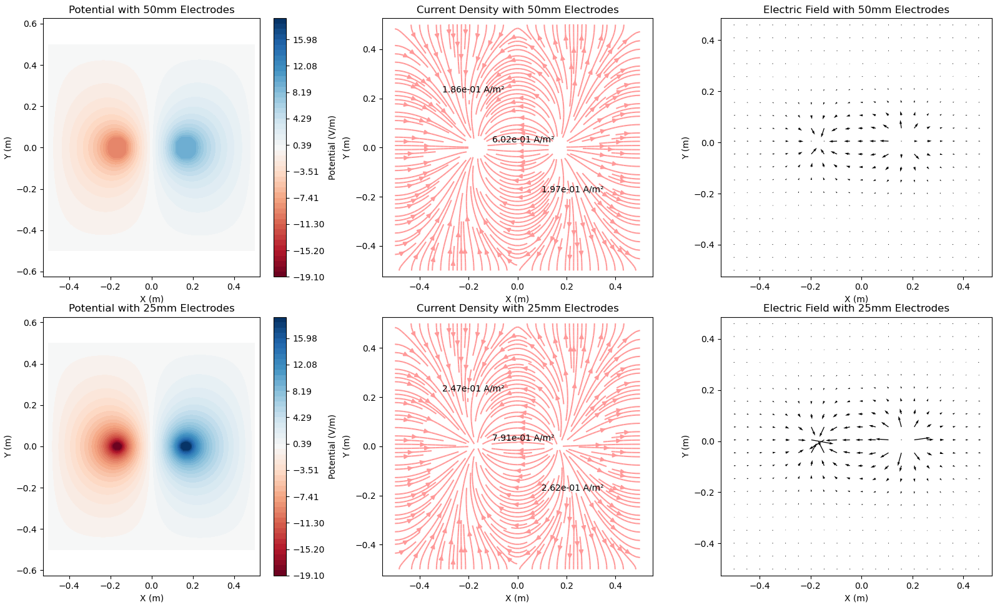

April 11, 2024
Ido Haber

---

This is a quick simplified simulation aim to illustrate the differnces in: - V/m - Current Density

given a 2D conductive isotropic medium and two different electrode geometries.

---

